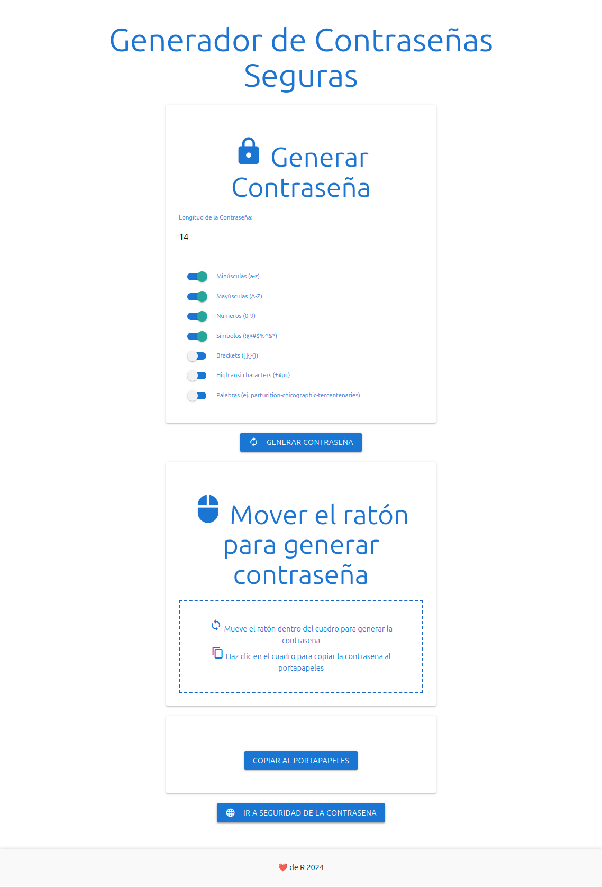

# Generador de Contraseñas Seguras

Este proyecto es una aplicación web interactiva para generar contraseñas seguras y personalizables. Utiliza HTML, CSS (Materialize) y JavaScript para ofrecer múltiples opciones de generación de contraseñas, incluyendo el uso del movimiento del ratón como fuente de entropía. Es una herramienta fácil de usar y completamente adaptable a dispositivos móviles.

## Características

- **Generación por Movimiento del Ratón**: Las contraseñas se generan utilizando el movimiento del ratón como fuente de entropía.
- **Opciones de Personalización**: Puedes incluir o excluir minúsculas, mayúsculas, números, símbolos, brackets, caracteres ANSI o generar contraseñas mediante palabras.
- **Copia al Portapapeles**: Una vez generada, la contraseña puede ser copiada fácilmente al portapapeles con un solo clic.
- **Interfaz Adaptable**: La aplicación es responsiva y se adapta perfectamente a dispositivos móviles y de escritorio.

## Requisitos

Este proyecto es completamente del lado del cliente, por lo que solo necesitas un navegador moderno para ejecutarlo.

## Cómo Usar

1. **Clonar el Repositorio**:
   Clona este repositorio en tu máquina local:
   
   - git clone https://github.com/tu-usuario/generador-contraseñas.git
     
2. **Abrir el Archivo HTML**
     - open index.html

## Personaliza la Contraseña:

- Selecciona la longitud deseada y las opciones de caracteres (minúsculas, mayúsculas, números, símbolos, etc.).
- Mueve el ratón dentro del cuadro para generar la contraseña.
- Haz clic en el cuadro para copiar la contraseña generada.

## Opciones de Personalización

- **Longitud de la Contraseña**: Ajusta la longitud entre 14 y 100 caracteres.
- **Caracteres Incluidos**:
  - Minúsculas (a-z)
  - Mayúsculas (A-Z)
  - Números (0-9)
  - Símbolos (!@#$%^&*)
  - Brackets ([]{}())
  - Caracteres ANSI (±¥µç)
- **Modo por Palabras**: Alterna la opción de generar contraseñas basadas en palabras (e.g. "palabra-palabra-palabra").

## Funcionalidades Clave

- **Generación de Contraseñas**: Utiliza el movimiento del ratón para generar contraseñas seguras.
- **Copiar Contraseña**: Haz clic para copiar la contraseña generada al portapapeles.
- **Seguridad de la Contraseña**: Enlace a la Wikipedia para aprender más sobre la seguridad de las contraseñas.

## Tecnologías Utilizadas

- **HTML5**
- **CSS3** (Materialize para el estilo y los componentes de interfaz)
- **JavaScript** (para la lógica de generación y personalización)

## Licencia

Este proyecto está bajo la Licencia MIT. Puedes consultar más detalles en el archivo [LICENSE](LICENSE).

